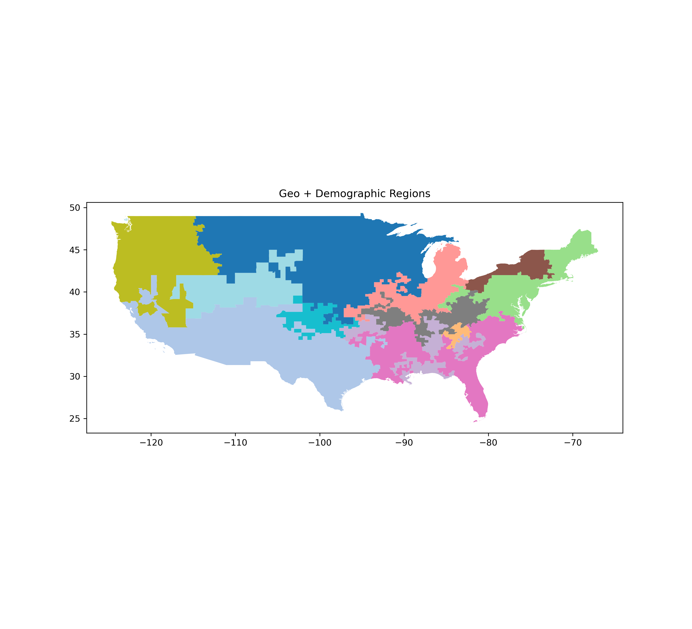
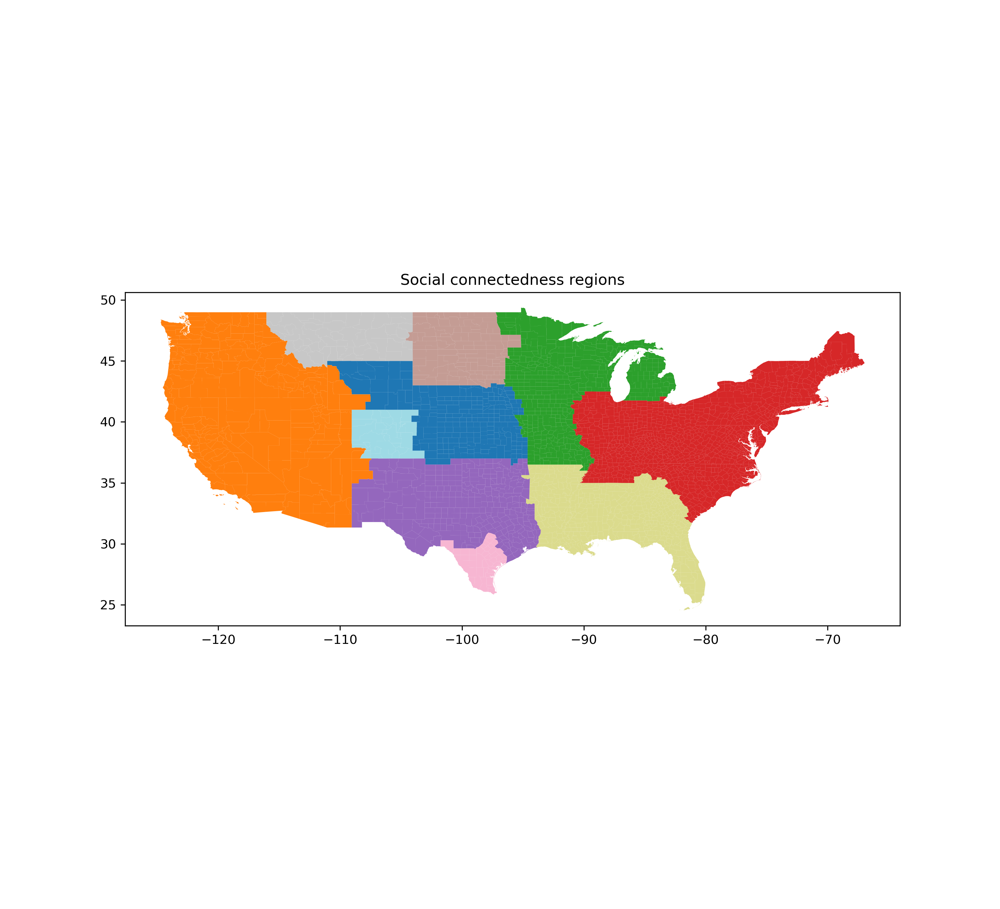

# data_driven_regions

## Introduction

A while back, Nate Silver tweeted his attempt to divide the US into a series of regions [[tweet]](https://twitter.com/NateSilver538/status/1199686800752726025?s=20&t=9HRz_7h-jve4Esk7mMoKjQ). He didn't describe his methods, but they seemed in part data driven and in part subjective. See [Jeremy Posada's website](https://jeremyposadas.org/regions/) for another interesting attempt at this problem.

Since then, I've been interested in finding a better way to define regions. The categories people largely use now (Midwest, northeast / New England, etc.) affect our perception of how related certain areas are to each other, but what if they don't reflect the actual relatedness of the areas? For example, I live near the southern tier of New York, and it can feel a lot like the midwest, but since it's in New York, it's considered the northeast. 

## Scripts

This respository contains two notebooks that attempt to define regions in a data-driven manner -- *cluster_regions_demographics* and *FB_network_connectivity*.

*cluster regions_demographics* forms regions by KMeans clustering on geographical and demographic information. Here's an example output: 

*FB_network_connectivity* forms regions by agglomerative clustering on a measure of the relative number of facebook friends between counties. Here's an example output:

## Application

This project was mostly done for fun. Still, the process of defining regions in a data-driven manner could be used to reduce gerrymandering in states, or to better group areas when analyzing differences over geographic regions.