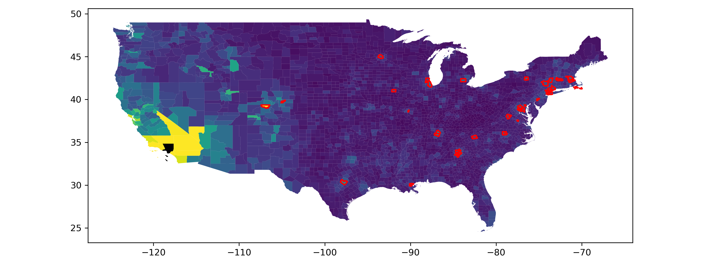
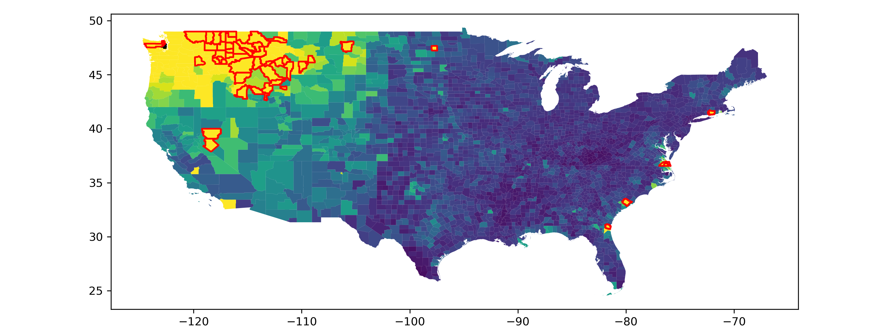
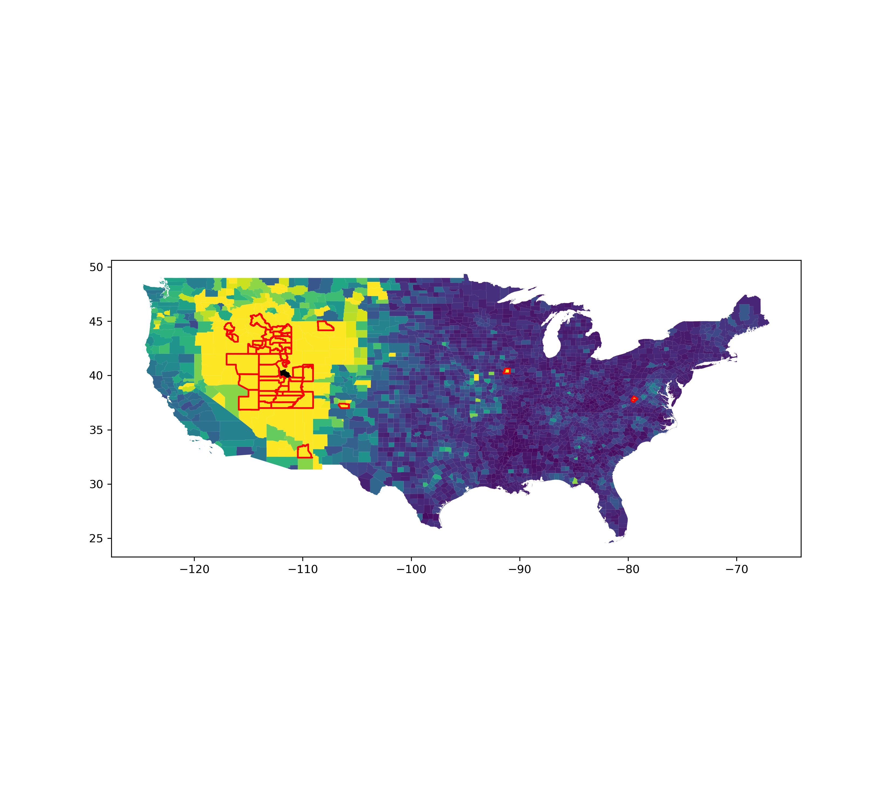

# Uniquely-connected-counties

## Introduction

*Want to know which counties your county is uniquely connected to? Find interesting relationships between counties?*

It turns out Meta has an excellent [dataset](https://dataforgood.facebook.com/dfg/tools/social-connectedness-index) for this exact problem. Created by [Bailey et. al, 2018](https://www.aeaweb.org/articles?id=10.1257/jep.32.3.259), the dataset defines the social connectedness index as the proportion of friendships of users in one county with users in another county. In the New York Times [write up](https://www.nytimes.com/interactive/2018/09/19/upshot/facebook-county-friendships.html) of county level Facebook friendship data, one section (*Where History Remains Visible*) pointed out some unexpected relationships between areas as a result of historical migrations:

>Northern cities like Chicago and Milwaukee still retain close ties to Southern counties along the Mississippi River, where African-American workers who were part of the Great Migration starting a century ago left communities for industrial jobs in the North. Kern County, Calif., holds ties today to counties in Oklahoma, where the Dust Bowl in the 1930s led to another significant migration (oil-producing Kern County today is also closely tied to parts of northwest North Dakota that are experiencing an oil boom).

The premise of this project is there are all sorts of interesting relationships between counties that would be interesting to identify, but laborous to find manually. This project algorithmically finds unqiue relationships between counties.

## Methods

To algorithmically find interesting relationships between counties, I use two steps:
1. Predict the social connectedness between countiesby using simple machine learning algorithms (linear regression and k-nearest neighbors)
2. Measure the difference between the expected number of friendships and the actual number of friendships. Then, the uniquely connected counties are those where the actual number of friendships is much greater than the expected.

## Results

Two example use cases for this repo:
1. For a given county, identify the counties it is uniquely connected to
2. For all possible county pairs, identify the most suprising connections

### For a given county, identify the counties it is uniquely connected to

#### Cook County (Chicago) Illinois

**SCI**

**Uniquely connected counties**

#### County of Los Angeles, CA

**SCI**

**Uniquely connected counties**

### For all possible county pairs, identify the most suprising connections

Some interesting county pairs identified by this algorithm: 

#### Camden county Georgia and Kitsap Washington

Turns out they both have a naval base! Groton Connecticut, also highlighted (and maybe those other highlighted counties on the east coast) has one too.

#### Utah, Utah and Buena Vista City

Buena Vista City Virginia is home to Southern Virginia University, a [Mormon University](https://archive.sltrib.com/article.php?id=9363275&itype=NGPSID)
